# Arquitectura del sistema — Stream Media

Especificación de arquitectura del servicio de streaming auto-hospedado.
Describe **lo que está implementado**, no lo planeado; las brechas conocidas
están en la última sección y marcadas como tales.

Los diagramas son [Mermaid](https://mermaid.js.org/) embebido, que GitHub
renderiza sin build. Si algún día hace falta algo que Mermaid no da (diagramas
de despliegue con anotaciones ricas, por ejemplo), la convención es agregar un
`.puml` en `docs/` y referenciarlo desde acá, no mezclar los dos formatos en el
mismo diagrama.

**Documentos relacionados:** `CLAUDE.md` (convenciones e invariantes en prosa),
`stream-media-design.html` (diseño original; su API y su pipeline están
superados). Ante una contradicción, manda `CLAUDE.md`.

---

## 1. Qué problema resuelve

Reproducir en el navegador una película que está en un disco de casa, sin
convertirla de antemano y sin perder las pistas de audio ni los subtítulos que
trae.

Las tres restricciones que dan forma a todo lo demás:

1. **El navegador no reproduce MKV**, ni H.265, ni DTS. Hay que reempaquetar y,
   a veces, recodificar.
2. **Recodificar es caro** — minutos para un remux, horas para AV1. No se puede
   hacer sincrónicamente dentro de una request.
3. **Cambiar de idioma no puede cortar la reproducción.** Esto es lo que
   descarta el diseño obvio (audio multiplexado en el video) y obliga al de
   pistas separadas.

### Atributos de calidad priorizados

| Atributo | Cómo se persigue | Qué se sacrificó |
|---|---|---|
| Time-to-first-frame | Playlist EVENT mientras se construye; se reproduce apenas hay segmentos en disco | Complejidad: dos formatos de playlist |
| Costo de reapertura | Cache persistente indexado por `(ruta, mtime, tamaño)` | Disco: hasta `MAX_CACHE_SIZE` |
| Cambio de idioma instantáneo | Renditions de audio separadas del video | Un proceso FFmpeg por pista |
| Simplicidad operativa | Un contenedor, sin cola de trabajos, sin broker | Sin escalado horizontal |

---

## 2. Vista de contexto

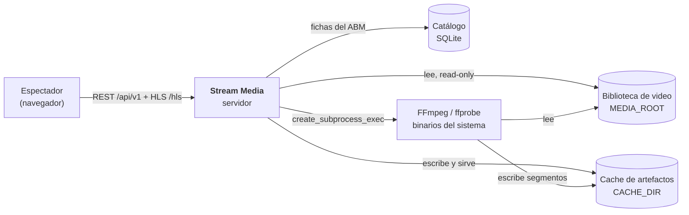

Dos cosas que este diagrama tiene que dejar claras:

- **FFmpeg escribe directo en el cache.** El servidor no proxea bytes de video;
  le da a FFmpeg un directorio de salida y después sirve esos archivos como
  estáticos. Nunca pasan por el event loop.
- **El origen se lee, nunca se escribe.** El montaje es `:ro` en Compose, y esa
  es una garantía de despliegue, no una convención del código.

---

## 3. Vista de contenedores

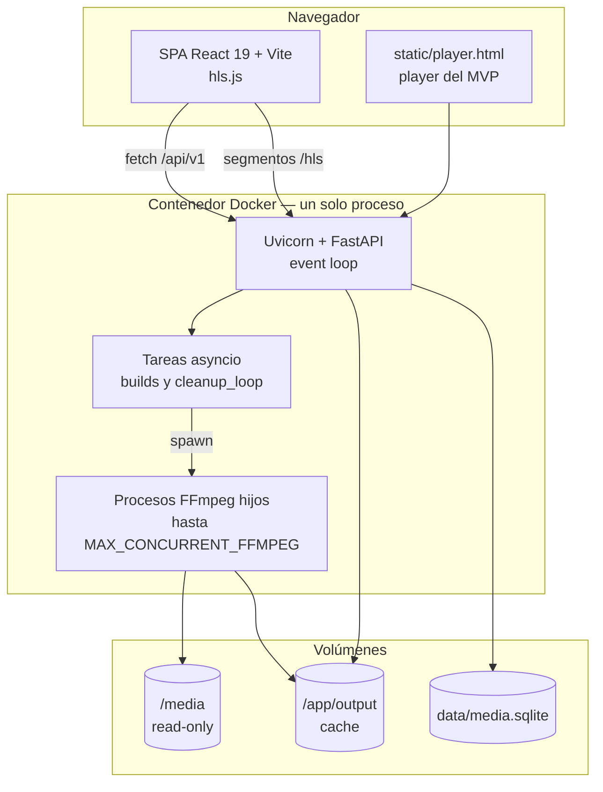

**Es un solo proceso.** No hay worker aparte, ni Redis, ni cola. Los builds son
tareas `asyncio` en el mismo intérprete que atiende las requests, coordinadas
por un semáforo. Es una decisión deliberada de homelab (ver §13), y es también
de donde salen sus límites (§11).

---

## 4. Vista de componentes

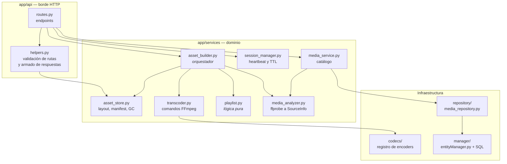

### Responsabilidades

| Componente | Es dueño de | No sabe nada de |
|---|---|---|
| `asset_builder` | El ciclo de vida del asset: abrir, decidir qué falta, lanzar y supervisar builds | HTTP, la base de datos, las fichas |
| `asset_store` | El layout en disco, el `manifest.json`, el uso de espacio y el GC | FFmpeg, playlists |
| `transcoder` | Armar los argumentos de FFmpeg y manejar el proceso | Qué asset es, por qué se lo llama |
| `playlist` | Producir los `.m3u8` a partir de duraciones y nombres | Disco, FFmpeg, red |
| `media_analyzer` | Interpretar ffprobe y modelar el origen | Cache, sesiones |
| `session_manager` | Quién está mirando y desde cuándo | Archivos, builds |
| `media_service` | El catálogo editorial | El cache HLS |

**La dependencia que no existe** es tan importante como las que sí: el
`asset_builder` **no conoce la base de datos**. Su `SourceInfo` sale del
manifest del cache o de un ffprobe nuevo. Por eso la selección de pistas viaja
como dos conjuntos de índices desde la capa HTTP, que es la única que tiene la
ficha en la mano.

`playlist.py` es lógica pura: entra una lista de duraciones y sale un string. No
toca disco ni red, y es donde vive `test_playlist.py`, la suite más valiosa del
proyecto.

---

## 5. Vista de datos

### 5.1 Modelo de dominio

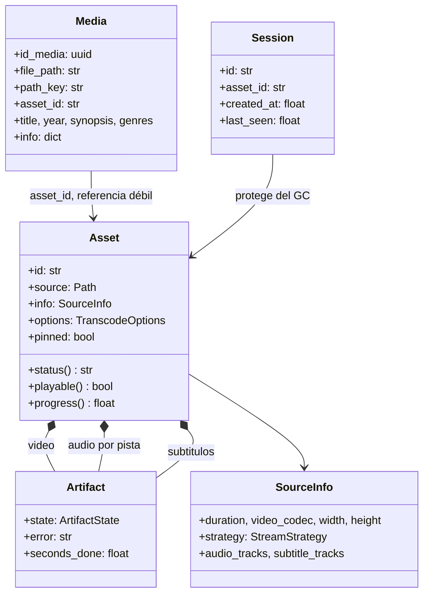

**`Media` ↔ `Asset` es una relación débil a propósito.** La ficha guarda un
`asset_id` calculado, pero el asset puede no existir todavía, o haber sido
borrado por el GC. Nada valida esa referencia: el `asset_id` se recalcula de la
terna `(ruta, mtime, tamaño)` cada vez que hace falta, así que siempre coincide
mientras el archivo no cambie — y si cambia, *debe* dejar de coincidir.

### 5.2 Los tres ciclos de vida

Es el concepto que más confusión causa y conviene fijarlo:

| | `Media` (ficha) | `Asset` (artefactos) | `Session` (espectador) |
|---|---|---|---|
| **Dónde vive** | SQLite | Disco + memoria | Solo memoria |
| **Identidad** | UUID | `sha1(ruta\|mtime\|tamaño)` | UUID |
| **Sobrevive al reinicio** | Sí | Sí, vía el manifest | No |
| **Quién lo borra** | El usuario | El GC por LRU | El TTL |
| **Es dueño de archivos** | No | Sí | No |

Una `Session` **no es dueña de nada**: lo único que hace es proteger a su asset
del GC mientras tenga heartbeat.

### 5.3 Layout en disco

```
output/{asset_id}/
├── manifest.json               ← el estado que sobrevive al reinicio
├── video/
│   ├── init.mp4                ← init segment CMAF
│   ├── seg-00000.m4s …         ← segmentos, sin audio (-an)
│   └── internal.m3u8           ← de FFmpeg; NUNCA se sirve
├── audio/{n}/
│   ├── init.mp4
│   ├── seg-00000.m4s           ← sin video (-vn)
│   └── internal.m3u8
└── subs/sub_{n}_{lang}.vtt     ← estáticos, fuera del pipeline HLS
```

### 5.4 El manifest

`manifest.json` es **la única fuente de verdad que cruza reinicios**. Lo escribe
`AssetBuilder._save` en cada transición de estado.

```json
{
  "asset_id": "…",
  "source": "/media/…",
  "duration": 7412.3,
  "strategy": "remux",
  "video": "ready",
  "audio": {"0": "ready", "1": "building"},
  "subtitles": {"0": "sub_0_spa.vtt"},
  "subtitles_failed": [2],
  "info":    { "SourceInfo, incluidos los flags ignore": "…" },
  "options": { "TranscodeOptions con las que se construyó": "…" },
  "pinned": false
}
```

Dos campos merecen justificación, porque se los borraría por parecer
redundantes:

- **`options`** — describe *los segmentos que hay en disco*, no la
  configuración del servidor. Sin esto, un asset generado en AV1 y reabierto por
  un servidor configurado en H.264 se anunciaría como `avc1.640029` y el player
  abriría el SourceBuffer con un codec que no es el de los segmentos. `_load`
  las rehidrata de acá; un manifest viejo sin el bloque cae en la config del
  servidor, que es la que lo generó.
- **`subtitles_failed`** — PGS y VobSub son bitmap y **nunca** van a extraerse.
  Sin recordar el fracaso, cada apertura reintenta leer el archivo entero.

---

## 6. Vistas dinámicas

### 6.1 Alta de una ficha — `POST /api/v1/media`

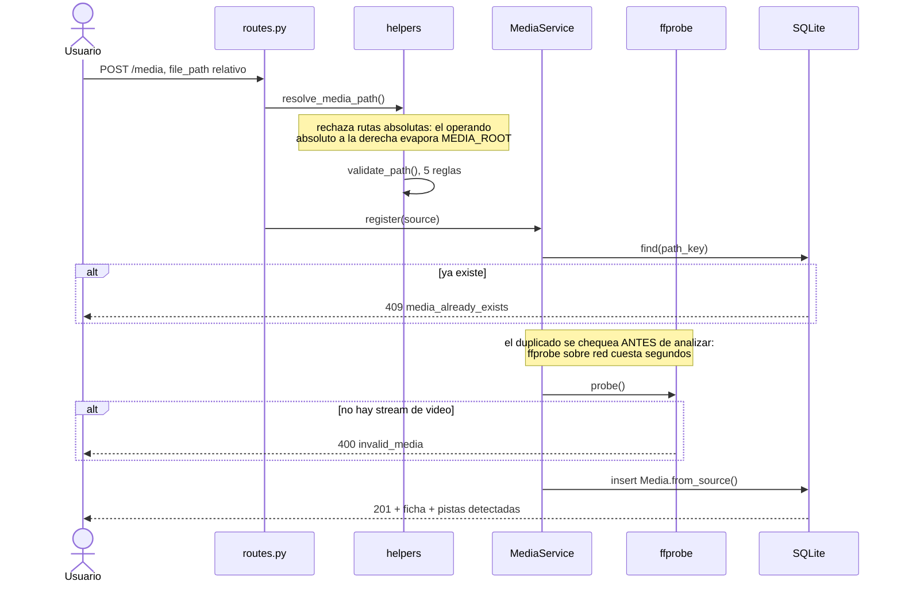

**El alta no codifica nada.** Eso es lo que permite que un solo `PATCH` alcance
para elegir pistas: entre el `POST` y el `PATCH` no hay trabajo que cancelar ni
artefactos que borrar.

### 6.2 Reproducir — `POST /api/v1/stream`

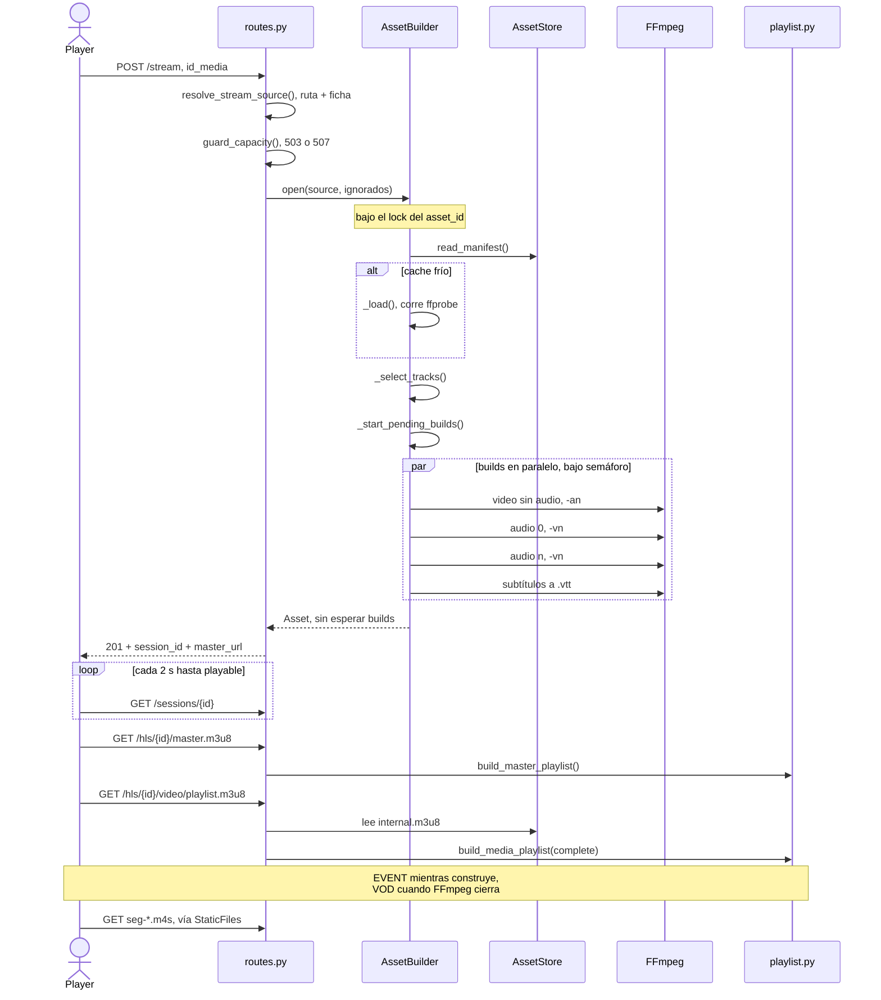

Lo que **no** pasa acá es igual de significativo: `open` no espera a ningún
build, y la respuesta sale en milisegundos aunque falten ocho minutos de
transcodificación.

### 6.3 Cambiar de idioma — sin servidor

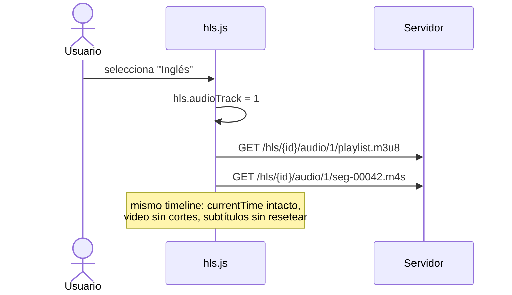

**No hay endpoint para esto y no lo va a haber**, igual que no lo hay para seek.
El master declara las renditions con `#EXT-X-MEDIA:TYPE=AUDIO` y el resto lo
resuelve el cliente. Si aparece una ruta de "cambiar pista", algo se rompió
conceptualmente.

### 6.4 Codificación de biblioteca — `POST /media/{id}/encode`

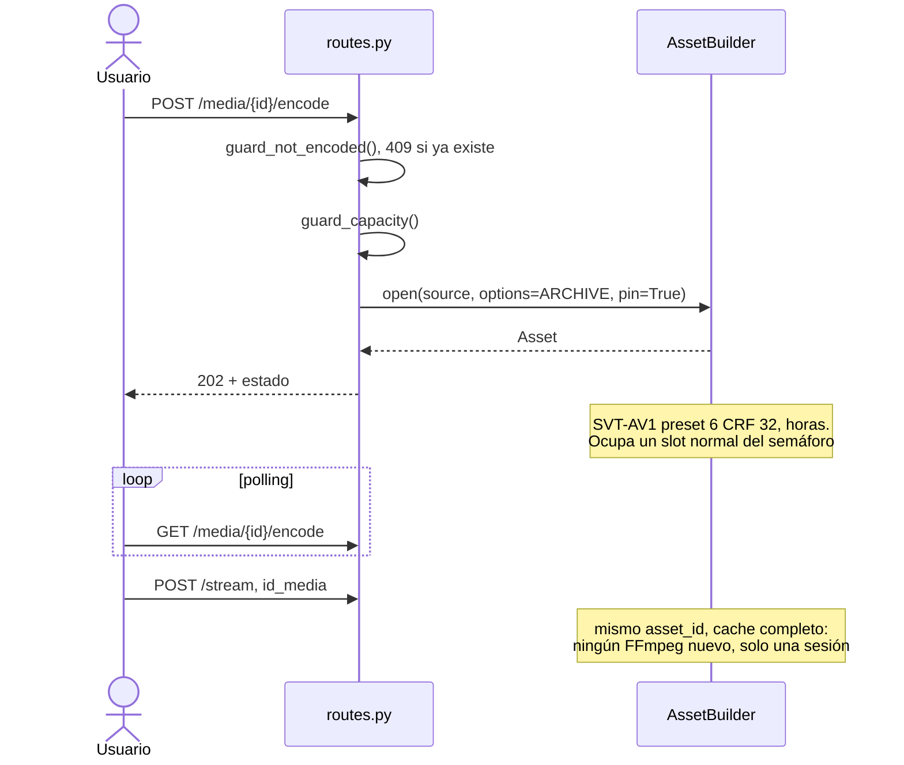

Los dos disparadores —`/stream` y `/encode`— alimentan **el mismo pipeline** y
producen **el mismo asset**. Lo único que cambia es el perfil y el `pin`.

### 6.5 Estados de un artefacto

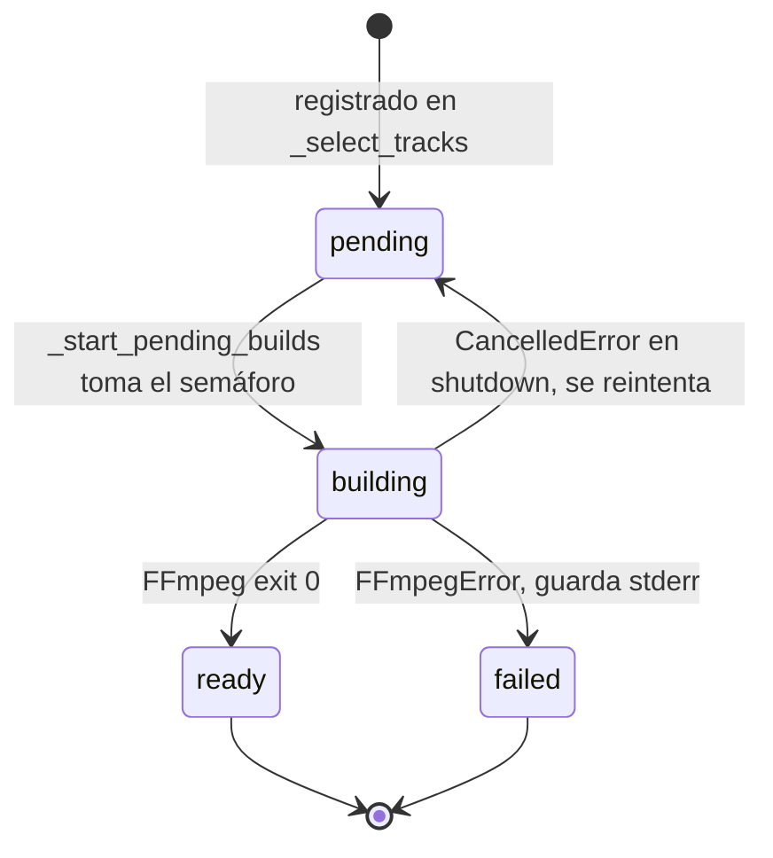

**Un artefacto que falla no arrastra a los demás.** Si se cae una pista de
audio, el video y los otros idiomas se siguen sirviendo. El `status` del asset
solo es `failed` si el que falló fue el video.

### 6.6 Ciclo de limpieza

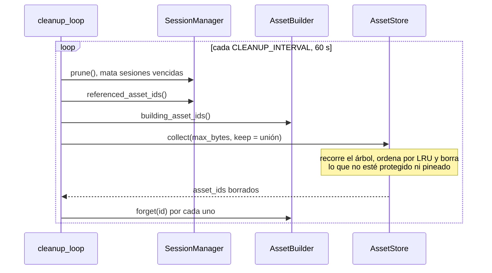

El `forget` no es opcional: sin él se seguirían sirviendo playlists que apuntan
a segmentos que ya no existen.

---

## 7. Vista de concurrencia

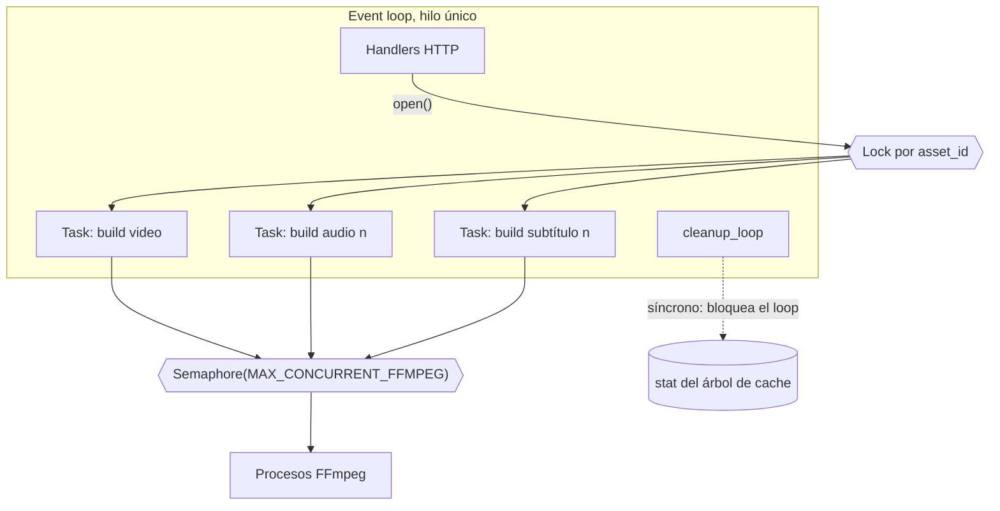

### Mecanismos

| Mecanismo | Dónde | Qué garantiza |
|---|---|---|
| `Lock` por `asset_id` | `AssetBuilder.open` | Dos requests simultáneas de la misma película no lanzan dos FFmpeg |
| `Semaphore(N)` | `AssetBuilder._run` | Nunca más de N FFmpeg vivos, sin importar de cuántos assets |
| `set` de tareas | `_spawn` | Las tareas no se recolectan mientras corren |
| `ManagedFFmpeg` | `transcoder` | Permite matar el proceso en el shutdown |
| Estado mutado in-place | `Artifact` | El polling de `/sessions/{id}` ve el avance sin tocar disco |

**Prioridad de los builds:** video primero, después audio, después subtítulos.
Compiten por el mismo semáforo leyendo el mismo archivo, y el video es lo único
que el usuario está esperando para poder mirar algo. El audio corre a ~200×
tiempo real, así que termina mucho antes de todos modos.

**Deuda conocida:** `AssetStore.collect` y el repositorio SQLite son
**sincrónicos** y se ejecutan dentro del event loop (`main.py:69`, `main.py:125`,
`helpers.py:207`). `_tree_size` hace `rglob` con dos syscalls por archivo sobre
un cache que puede tener decenas de miles de segmentos, en un bind mount de red.
Mientras corre no se atiende ninguna request ni se drena el stderr de FFmpeg. El
arreglo es `asyncio.to_thread`. Ver L3 en §11.

---

## 8. Vista de despliegue

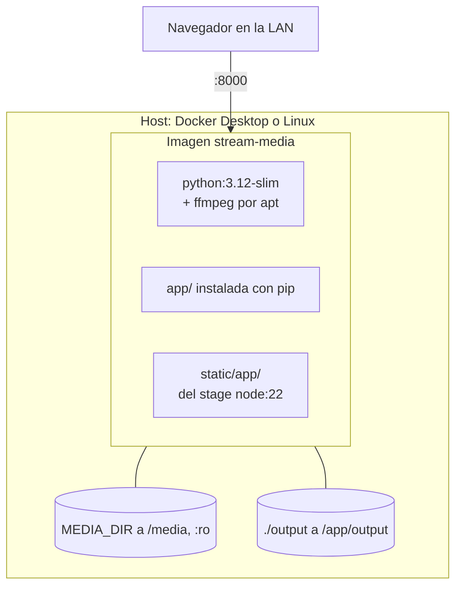

La imagen es **multi-stage**: un stage `node:22-slim` compila el SPA y la imagen
final no lleva Node, solo el bundle. El `COPY` del bundle va *después* del `COPY
static/` a propósito, para que no lo tape.

### Configuración

Todo por entorno con prefijo `SM_` (`app/config.py`). No hay `.env` hardcodeado;
el `.env` de Compose usa nombres propios más cortos que mapea a los `SM_`.

| Variable | Default | Efecto arquitectónico |
|---|---|---|
| `SM_MEDIA_ROOT` | `None` | Ancla de todas las rutas. Sin ella el catálogo no funciona |
| `SM_CACHE_DIR` | `output` | Raíz del cache persistente |
| `SM_DB_PATH` | `data/media.sqlite` | **Fuera del cache**: ahí manda el GC por tamaño |
| `SM_MAX_CACHE_SIZE` | 50 GiB | Umbral del LRU |
| `SM_MAX_CONCURRENT_FFMPEG` | 3 | Único control de admisión de carga |
| `SM_HLS_TIME` | 6 | Duración de segmento; afecta el time-to-first-frame |
| `SM_VIDEO_CODEC` | `h264` | Encoder por defecto, de `app/codecs` |

---

## 9. Espacio de URLs

El orden de registro **es** el orden de resolución de Starlette, y vive en un
solo bloque al final de `main.py`.

```mermaid
flowchart LR
    R["Request"] --> A["/docs, /openapi.json"]
    A -->|"no matchea"| B["/api/v1/*, router"]
    B -->|"no matchea"| C["/hls/{asset_id}/*.m3u8<br/>playlists calculadas"]
    C -->|"no matchea"| D["/api/{rest}<br/>404 con formato propio"]
    D -->|"no matchea"| E["mount /hls<br/>segmentos e init"]
    E -->|"no matchea"| F["mount /static<br/>player del MVP"]
    F -->|"no matchea"| G["mount /<br/>SPA, html=True"]
```

Tres reglas que no se reordenan:

1. **Las playlists calculadas van antes del mount `/hls`.** Si el mount ganara
   se serviría el `internal.m3u8` de FFmpeg. Es un fallo silencioso; hay test.
2. **`/api/{rest}` va antes del mount de `/`.** `StaticFiles` solo acepta GET y
   HEAD: un POST a un endpoint inexistente saldría `405` en vez de `404`, y con
   el `{"detail": …}` de Starlette en vez del formato de error del proyecto.
3. **El mount de `/` va último** — matchea todo y Starlette no reintenta.

**Nada se registra dentro del `lifespan`.** Ahí va solo estado: store, sessions,
builder, BD y GC. Cuando los mounts vivían ahí, el orden dependía del ciclo de
vida, y como `ASGITransport` no lo corre, los tests pasaban contra una app sin
mounts.

---

## 10. Invariantes de arquitectura

Las restricciones que el código da por ciertas. Romper cualquiera de estas no
produce un error: produce un bug silencioso.

### I1 · Timeline absoluto

Video, cada pista de audio y los subtítulos salen de **corridas separadas de
FFmpeg**. Que compartan origen de tiempo es lo único que los mantiene
sincronizados. Todos los comandos llevan:

```
-copyts -avoid_negative_ts disabled -muxdelay 0 -muxpreload 0
```

- **Nunca `-output_ts_offset`**: con `-copyts` los PTS ya son absolutos;
  sumarlo otra vez los duplica.
- **Nunca `-start_at_zero`**: contradice `-copyts`.

*Lo fijan:* `test_transcoder.py::test_no_usa_output_ts_offset_ni_start_at_zero`
y `::test_copyts_va_antes_del_input`.

### I2 · Las playlists se calculan, no se sirven

El `internal.m3u8` de FFmpeg **jamás llega al cliente**: se parsea solo para
conocer las duraciones reales. Corolario: **nunca `-hls_playlist_type vod`**,
porque con esa opción FFmpeg escribe la playlist recién al cerrar y durante todo
el build no hay de dónde leer las duraciones, aunque los `.m4s` estén en disco
desde el primer segundo.

Por la misma razón, `Asset.playable` cuenta archivos **en disco**, no entradas
de la playlist.

### I3 · Los `#EXTINF` son las duraciones reales

Declarar `6.000` uniforme cuando los segmentos no lo son desfasa los subtítulos,
y el error se acumula a lo largo de la película.

### I4 · `CODECS`: los dos o ninguno

En el master, **o se declaran video y audio, o se omite el atributo entero**.
Declarar solo el del audio no es "omitir el del video": anuncia un variant *sin*
video, hls.js espera un `BUFFER_CODECS` cuando van a llegar dos, y la segunda
pista se queda sin SourceBuffer. Pasa siempre que el codec de video no se puede
escribir — un AV1, que no declara nivel, o un H.264 con un perfil que
`avc_codec_string` no conoce.

*Lo fija:* un test en `test_playlist.py`.

### I5 · Asset ≠ Session

Dos conceptos, dos ciclos de vida (§5.2). Mezclarlos fue el error del diseño
anterior.

### I6 · No pasar selección de pistas significa generar todo

No significa "dejar como estaba". La ficha es la única fuente de esa decisión; la
copia que queda en el manifest es derivada y no manda. Abrir por `file_path`
—sin ficha, o desde el CLI— regenera el archivo completo.

Corolario: **el filtro se aplica en `open`, nunca en `_load`.** `_load` solo
corre con el cache frío; si el filtro viviera ahí, cambiar la selección de una
película ya abierta no haría nada *y no daría error*.

### I7 · El asset recuerda con qué se construyó

Las `TranscodeOptions` salen del manifest, no de la configuración del servidor.
Ver §5.4.

---

## 11. Limitaciones conocidas

Registradas a propósito, no descubiertas al escribir este documento.

| # | Limitación | Consecuencia | Destrabe |
|---|---|---|---|
| L1 | Un asset pineado nunca es candidato del GC y `DELETE /media` es `501` | Con 50 GiB y ~5,5 GB por película, cerca de la novena codificada el GC no libera nada y las aperturas nuevas salen `507` | Borrar el directorio a mano |
| L2 | Un encode interrumpido deja el manifest con el video en `pending` | El `409` lo da por existente para siempre, pero tocar Play relanza las seis horas | Borrar el directorio a mano |
| L3 | `collect` y el repositorio SQLite son sincrónicos dentro del event loop | Latencia errática bajo carga; el síntoma no se parece a la causa | `asyncio.to_thread` |
| L4 | Un subtítulo que falló viaja con `url: null`, igual que uno que todavía no está | El player dice "generando…" de un bitmap que no se va a generar nunca | Exponer el estado del artefacto en la respuesta |
| L5 | El `GET` del encode lee el manifest aunque el asset esté en memoria | I/O de red innecesario en un polling largo | Leer de memoria cuando está |
| L6 | Sin autenticación y con CORS en `*` | Aceptable en LAN, no fuera de ella | Ver el plan de hardening |

### Qué está pendiente de decidir

**Qué hacer cuando ya existe un asset.** Hoy es un `409` y borrado manual. Las
opciones son *reemplazar* (el encode pisa lo que haya), *convivir* (el
`asset_id` incorpora el perfil y `/stream` elige) o *preguntar al usuario*.
Ninguna está implementada, y la elección tiene consecuencias sobre la identidad
del asset, que es la pieza de la que cuelga todo el cache.

---

## 12. Estrategia de pruebas

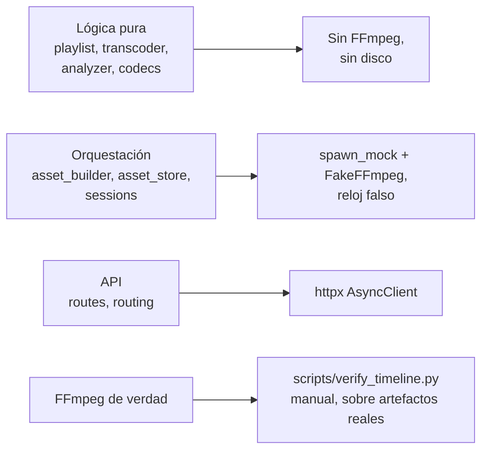

**Ningún test invoca los binarios reales.** `tests/conftest.py` provee
`spawn_mock`, `FakeFFmpeg` y el fixture `patched`, que parchea `analyze` y
`start_ffmpeg` en `asset_builder`.

Eso deja un hueco explícito: **que FFmpeg haga lo que se espera no lo cubre
ningún test**. Lo cubre `scripts/verify_timeline.py`, que se corre a mano sobre
artefactos ya generados y valida PTS absolutos, suma de `#EXTINF` contra la
duración real, keyframes en el borde de cada segmento y alineación audio/video.

---

## 13. Bitácora de decisiones

| # | Decisión | Alternativa descartada | Por qué |
|---|---|---|---|
| D1 | Audio separado del video como rendition group | Audio multiplexado; reiniciar FFmpeg al cambiar de idioma | Cambiar de idioma dejó de cortar el video y de perder `currentTime` |
| D2 | Playlists calculadas en cada request | Servir el `.m3u8` que escribe FFmpeg | Con `hls_playlist_type vod` no hay duraciones hasta el final del build |
| D3 | Segmentos fMP4/CMAF | MPEG-TS | Requisito para audio separado y para AV1 |
| D4 | Identidad `(ruta, mtime, tamaño)` | Hash del contenido | Hashear 5 GB en cada apertura; el mtime alcanza para invalidar |
| D5 | Cache persistente con LRU | Temporal que se borra al arrancar | Reabrir una película ya procesada no debería costar nada |
| D6 | Todas las pistas de audio de entrada | Generarlas bajo demanda | El audio-only corre a ~200× y termina antes que el video |
| D7 | El encode de biblioteca usa el semáforo común | Una cola de trabajos aparte | Es un homelab: no hay CPU para dos colas |
| D8 | Encoders en un registro (`app/codecs`) | Encoder hardcodeado en el transcoder | Agregar AV1 fue agregar una entrada a un diccionario |
| D9 | Un solo proceso, sin broker | Celery, RQ o un worker aparte | La carga real es un espectador y tres FFmpeg |
| D10 | Subtítulos como archivos estáticos | Segmentados como rendition WebVTT | Sus tiempos ya son absolutos; segmentarlos no aporta nada |
